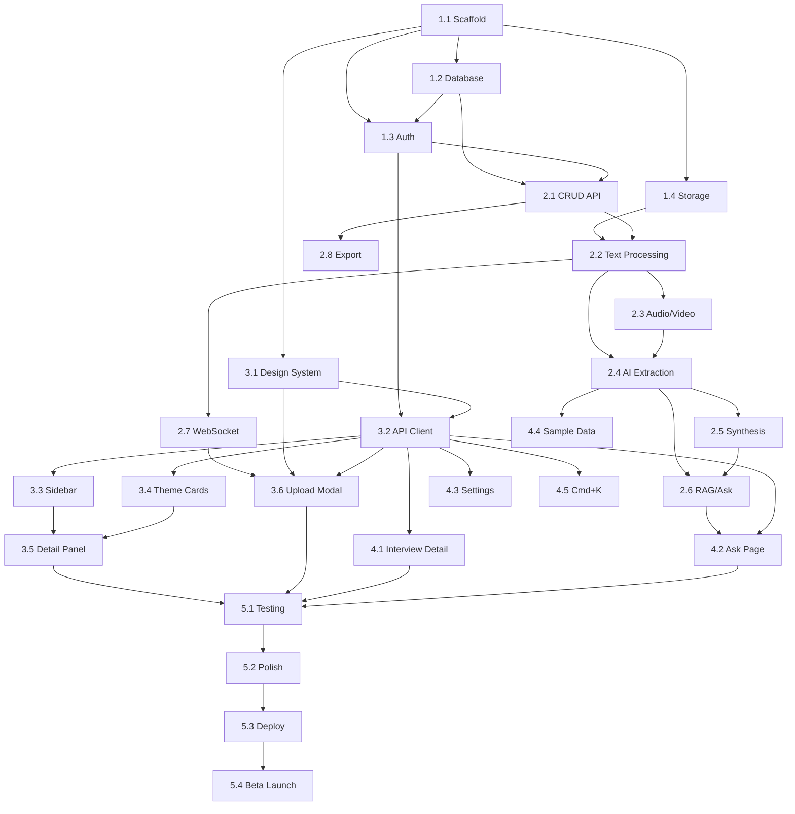

# Spec10x v0.1 — Project Tracker

> **Sprint:** Feb 23 – Feb 28, 2026 (5 days)
> **Goal:** Ship v0.1 MVP ("Interview Intelligence") — fully functional, deployed, ready for beta pilots
> **Team:** Solo developer (assisted by AI coding agents)

---

## Sprint Overview

```
Day 1 (Feb 23) — Foundation     │ Project setup, database, auth, infra
Day 2 (Feb 24) — Backend Core   │ API endpoints, file upload, AI pipeline
Day 3 (Feb 25) — Frontend Core  │ Design system, layout, dashboard, upload modal
Day 4 (Feb 26) — Frontend Pages │ Interview detail, Ask page, settings, integration
Day 5 (Feb 27) — Polish & Ship  │ Testing, bug fixes, deploy, beta invite
Buffer (Feb 28) — Contingency   │ Overflow, hot fixes, final QA
```

---

## Day 1 — Foundation (Feb 23, Sunday)

> **Goal:** Project scaffold running locally with database, auth, and file storage working end-to-end.

### 1.1 Project Scaffold
- [ ] Initialize monorepo structure (`frontend/`, `backend/`, `infra/`)
- [ ] **Frontend:** `npx create-next-app@latest ./frontend` (Next.js 16, TypeScript, App Router, Turbopack)
- [ ] **Backend:** Create FastAPI project with `pyproject.toml`, virtual env, folder structure
- [ ] Create `docker-compose.yml` — PostgreSQL 18 + pgvector, Redis 8, MinIO (GCS local)
- [ ] Verify all three services start (`npm run dev`, `uvicorn`, `docker compose up`)
- [ ] Create `.env.example` with all required env vars

**Dependencies:** None (this is the starting point)
**Deliverable:** Running frontend + backend + Docker services locally

---

### 1.2 Database Schema & Migrations
- [ ] Install SQLAlchemy 2.0 + Alembic
- [ ] Create ORM models: `User`, `Interview`, `Speaker`, `Theme`, `SubTheme`, `Insight`, `TranscriptChunk`, `AskConversation`, `AskMessage`, `Usage`
- [ ] Set up pgvector extension (`CREATE EXTENSION vector`)
- [ ] Generate initial Alembic migration
- [ ] Run migration, verify all tables created
- [ ] Create seed script for sample/demo data (the "Try with sample data" feature)

**Dependencies:** 1.1 (Docker PostgreSQL running)
**Deliverable:** All tables created, sample data loaded

---

### 1.3 Authentication
- [ ] Create Firebase project in GCP Console
- [ ] Enable Email/Password and Google OAuth providers
- [ ] Backend: Create `core/auth.py` — Firebase Admin SDK for JWT verification
- [ ] Backend: Create auth middleware — verify token on every API request, extract `user_id`
- [ ] Backend: `POST /api/auth/verify` — verify Firebase token, create or get user in our DB
- [ ] Frontend: Install `firebase` SDK, create auth helpers in `lib/auth.ts`
- [ ] Frontend: Create sign-up page (email + Google OAuth)
- [ ] Frontend: Create login page
- [ ] Frontend: Create auth context/provider — manage session, redirect unauthenticated users
- [ ] Test: Sign up → login → API call with token → user created in DB

**Dependencies:** 1.1 (project running), 1.2 (users table exists)
**Deliverable:** Full auth flow working — sign up, login, protected routes

---

### 1.4 File Storage Setup
- [ ] Create GCS bucket (or MinIO bucket for local dev)
- [ ] Backend: Create `core/storage.py` — generate signed upload URLs, download files
- [ ] Backend: `POST /api/interviews/upload-url` — returns signed URL for direct browser upload
- [ ] Test: Frontend can upload a file directly to GCS/MinIO via signed URL

**Dependencies:** 1.1 (MinIO or GCS configured)
**Deliverable:** Files upload from browser directly to storage

---

### 1.5 GCP Infrastructure (Staging)
- [ ] Create GCP project `spec10x`
- [ ] Enable APIs: Cloud Run, Cloud SQL, Cloud Storage, Speech-to-Text, Vertex AI
- [ ] Create Cloud SQL instance (PostgreSQL 18, db-f1-micro)
- [ ] Enable pgvector extension on Cloud SQL
- [ ] Create Memorystore Redis instance (Basic, 1GB)
- [ ] Create GCS bucket `spec10x-uploads`
- [ ] Create service account with required IAM roles
- [ ] Set up Vertex AI — enable Gemini and Speech-to-Text APIs

**Dependencies:** GCP account, billing enabled
**Deliverable:** All GCP services provisioned and accessible

---

## Day 2 — Backend Core (Feb 24, Monday)

> **Goal:** Full backend API with AI processing pipeline working. Upload a file → get insights back.

### 2.1 Core API Endpoints (CRUD)
- [ ] `POST /api/interviews` — register uploaded file, create Interview record, enqueue processing job
- [ ] `GET /api/interviews` — list all interviews for user (with filters, sort)
- [ ] `GET /api/interviews/:id` — interview detail (transcript + insights)
- [ ] `DELETE /api/interviews/:id` — delete interview, cascade insights, recalculate themes
- [ ] `GET /api/themes` — list all themes for user (sorted, paginated)
- [ ] `GET /api/themes/:id` — theme detail (quotes, sources, sentiment)
- [ ] `PATCH /api/themes/:id` — rename theme
- [ ] `POST /api/insights` — manually add insight
- [ ] `PATCH /api/insights/:id` — edit insight (category, title, theme)
- [ ] `DELETE /api/insights/:id` — dismiss insight (soft delete)
- [ ] `POST /api/insights/:id/flag` — flag as uncertain

**Dependencies:** 1.2 (database), 1.3 (auth middleware)
**Deliverable:** All CRUD endpoints working (testable via HTTP client / Swagger)

---

### 2.2 File Processing Pipeline — Text Extraction
- [ ] Install `arq` (async Redis job queue) or set up Celery
- [ ] Create worker entry point (`workers/main.py`)
- [ ] Implement text extraction: `.txt` → read directly, `.md` → read directly
- [ ] Implement text extraction: `.pdf` → PyPDF2 or pdfplumber
- [ ] Implement text extraction: `.docx` → python-docx
- [ ] Create `process_interview` job: download file from GCS → extract text → save transcript to DB
- [ ] Update interview status through pipeline: `queued` → `analyzing` → `done`
- [ ] Test: Upload a `.txt` transcript file → text appears in DB

**Dependencies:** 1.4 (file storage), 2.1 (interview endpoints)
**Deliverable:** Text files processed end-to-end

---

### 2.3 File Processing Pipeline — Audio/Video
- [ ] Install FFmpeg in worker Docker container
- [ ] Implement video → audio extraction: `ffmpeg -i input.mp4 -vn -acodec pcm_s16le -ar 16000 -ac 1 output.wav`
- [ ] Implement Chirp 3 transcription via `google.cloud.speech_v2` SDK
  - [ ] Configure speaker diarization (auto-detect speakers)
  - [ ] Handle long audio via `BatchRecognize` API
  - [ ] Handle short audio via `Recognize` API (sync)
- [ ] Update pipeline: `queued` → `transcribing` → `analyzing` → `done`
- [ ] Duration limit check: reject files exceeding plan limit (15/30/45 min)
- [ ] Test: Upload an `.mp3` → transcription appears in DB with speaker labels

**Dependencies:** 2.2 (basic pipeline), 1.5 (Vertex AI enabled)
**Deliverable:** Audio/video files transcribed via Chirp 3

---

### 2.4 AI Analysis — Theme Extraction
- [ ] Create `services/analysis.py` — Gemini 2.5 Flash-Lite prompt for structured extraction
- [ ] Design extraction prompt: input = transcript, output = JSON with insights, speakers, themes, sentiment
- [ ] Implement structured output parsing (Gemini JSON mode)
- [ ] Save extracted insights to DB (linked to interview, with quote positions)
- [ ] Save detected speakers to DB
- [ ] Handle low-confidence extractions (flag with `is_flagged = true`)
- [ ] Test: Process a real interview → insights appear in DB with quotes, themes, sentiment

**Dependencies:** 2.2 or 2.3 (transcript in DB), 1.5 (Vertex AI Gemini)
**Deliverable:** AI extraction working — interviews produce structured insights

---

### 2.5 AI Analysis — Cross-Interview Synthesis
- [ ] Create `services/synthesis.py` — theme clustering logic
- [ ] After each interview is processed, run synthesis for the user:
  - [ ] Collect all `theme_suggestion` values from all insights
  - [ ] Embed theme suggestions using gemini-embedding-001
  - [ ] Cluster by cosine similarity (threshold: 0.85)
  - [ ] Create or update `Theme` records
  - [ ] Link insights to themes
  - [ ] Calculate aggregated sentiment per theme
  - [ ] Mark new themes with `is_new = true`
- [ ] Handle Signal vs Theme (1 source = Signal, 2+ = Theme)
- [ ] Test: Upload 3 interviews → themes auto-cluster across them

**Dependencies:** 2.4 (insights in DB)
**Deliverable:** Themes auto-cluster across interviews

---

### 2.6 Embedding & RAG Setup
- [ ] Create `services/embeddings.py` — chunk transcripts, generate embeddings
- [ ] Implement chunking: ~500 tokens with 50-token overlap
- [ ] Generate embeddings via gemini-embedding-001 (768 dims via MRL)
- [ ] Store chunks + embeddings in `transcript_chunks` table (pgvector)
- [ ] Create ivfflat index on embeddings column
- [ ] Create `services/qa.py` — RAG pipeline:
  - [ ] Embed user query
  - [ ] Vector similarity search (top 20 chunks)
  - [ ] Pass to Gemini 3 Flash with system prompt + context + user query
  - [ ] Parse response with citations
  - [ ] Return structured answer
- [ ] `POST /api/ask` — SSE streaming endpoint for Q&A
- [ ] `GET /api/ask/conversations` — list conversations
- [ ] `GET /api/ask/conversations/:id` — conversation detail
- [ ] Test: Ask "What are the biggest pain points?" → get cited answer

**Dependencies:** 2.4 (insights), transcripts in DB, 1.5 (Vertex AI)
**Deliverable:** "Ask Your Interviews" fully working on the backend

---

### 2.7 WebSocket — Real-Time Updates
- [ ] Create WebSocket endpoint `WS /ws/processing`
- [ ] Broadcast processing status updates per file (queued, transcribing, analyzing, done)
- [ ] Broadcast new insights as they're discovered (for live preview in upload modal)
- [ ] Use Redis pub/sub for cross-instance coordination
- [ ] Test: Start processing → WebSocket receives real-time status updates

**Dependencies:** 2.2 (processing pipeline), Redis
**Deliverable:** Real-time updates flowing from backend to frontend

---

### 2.8 Export & Billing Endpoints
- [ ] `GET /api/export/insights` — export all insights as markdown (structured theme report)
- [ ] `GET /api/export/insights?format=pdf` — export as PDF (using `weasyprint` or `reportlab`)
- [ ] `GET /api/export/interview/:id` — export single interview transcript + insights
- [ ] `GET /api/export/all-data` — full data export as ZIP
- [ ] `GET /api/billing/usage` — return current usage stats (interviews count, Q&A queries, storage)
- [ ] Create usage tracking middleware — increment counters per action
- [ ] Implement plan limit checks — block actions when limits exceeded, return upgrade prompt

**Dependencies:** 2.1 (API endpoints), 2.4 (insights exist)
**Deliverable:** Export and usage tracking working

---

## Day 3 — Frontend Core (Feb 25, Tuesday)

> **Goal:** Dashboard and upload modal fully functional with real data from the API.

### 3.1 Design System & Global Layout
- [ ] Create `styles/design-tokens.css` — all color, font, spacing, shadow variables
- [ ] Import Inter + JetBrains Mono fonts (Google Fonts)
- [ ] Create global layout: top nav bar (64px) persistent across all pages
- [ ] Implement top nav: Logo, "Dashboard" link, "Ask ✨" link, search bar (⌘K), bell, avatar, gear
- [ ] Implement active page indicator (blue underline)
- [ ] Create base UI components: `Button`, `Card`, `Badge`, `Input`, `Pill`, `Modal`, `Tooltip`
- [ ] Create loading skeleton components (for data loading states)
- [ ] Dark mode styles as default

**Dependencies:** Frontend scaffold (1.1)
**Deliverable:** Design system + global layout with nav bar

---

### 3.2 API Client & Auth Integration
- [ ] Create `lib/api.ts` — API client with axios/fetch, auto-attach Firebase token
- [ ] Create `hooks/useAuth.ts` — auth context, login/logout, redirect
- [ ] Create `hooks/useInterviews.ts` — SWR/React Query hook for interviews list
- [ ] Create `hooks/useThemes.ts` — hook for themes list
- [ ] Create `hooks/useWebSocket.ts` — WebSocket connection for real-time updates
- [ ] Implement protected route wrapper — redirect unauthenticated users to login

**Dependencies:** 3.1 (layout), 1.3 (auth), 2.1 (backend API)
**Deliverable:** Frontend can fetch and display data from backend

---

### 3.3 Insight Dashboard — Left Sidebar
- [ ] Interview Library component (240px sidebar)
- [ ] "+ Upload" button (electric blue, full width)
- [ ] Search/filter input
- [ ] Scrollable interview list (participant name, role, sentiment dot, theme count)
- [ ] Selected/active state (blue left border)
- [ ] Sort dropdown (Recent first, By name, By sentiment)
- [ ] Stats footer (interviews · insights · themes)
- [ ] Empty state: "No interviews yet" with pulsing upload button

**Dependencies:** 3.2 (API hooks), 3.1 (design system)
**Deliverable:** Sidebar showing real interview data from API

---

### 3.4 Insight Dashboard — Center Theme Area
- [ ] Header row: title, subtitle, sort toggles, "Ask" input
- [ ] Theme card component (reusable):
  - [ ] Theme name + NEW badge
  - [ ] Mention count pill
  - [ ] Sentiment bar (proportional red/amber/green)
  - [ ] 2 truncated quotes with source names
  - [ ] Sub-theme pills
  - [ ] Hover glow effect
  - [ ] Click → loads detail in right panel
- [ ] Theme card grid (2-column, responsive)
- [ ] "Show more themes" toggle
- [ ] "Previous themes" collapsible section
- [ ] Empty state: illustration + "Upload your first interviews" CTA + "Try with sample data"
- [ ] Sort switching logic (urgency, frequency, sentiment, recency)

**Dependencies:** 3.2 (API hooks), 3.1 (design system)
**Deliverable:** Theme cards displaying real insights from API

---

### 3.5 Insight Dashboard — Right Detail Panel
- [ ] Theme detail view (when theme card clicked):
  - [ ] Theme title with edit icon (inline rename)
  - [ ] Stats row
  - [ ] Sentiment breakdown bar with percentages
  - [ ] Key quotes section (quote cards with sentiment-colored left borders)
  - [ ] "Show context" expand for each quote
  - [ ] Sources list
  - [ ] Related themes pills
- [ ] Interview detail view (when interview clicked in sidebar):
  - [ ] Participant info, quick stats, theme pills
  - [ ] Key quotes from this interview
  - [ ] "View full transcript →" button
- [ ] Default state: "Select a theme or interview to see details"

**Dependencies:** 3.3 (sidebar), 3.4 (theme cards)
**Deliverable:** Fully functional 3-panel dashboard

---

### 3.6 Upload Modal
- [ ] Modal component (720px, 80vh, dark backdrop, overlay)
- [ ] Drop zone (drag & drop, click to browse, format pills)
- [ ] Collapsed drop zone state (compact bar after files added)
- [ ] Processing queue:
  - [ ] File rows (icon, filename, size, status indicator)
  - [ ] Per-file progress bars
  - [ ] Status states: queued → transcribing → analyzing → done → error
  - [ ] Remove file button (hover)
  - [ ] Duration limit exceeded warning
  - [ ] Overall status bar ("Processing: 3 of 5 files")
- [ ] Live insight preview (right side):
  - [ ] Streaming insight cards with theme, quote, sentiment
  - [ ] Pulsing green dot
- [ ] Connect to WebSocket for real-time status updates
- [ ] Metadata review step (post-processing):
  - [ ] File-by-file expandable rows (filename + detection summary)
  - [ ] Editable fields (participant name, role, company)
  - [ ] Auto-detected values with ✓ label
  - [ ] Multi-speaker file handling
  - [ ] Skip / Save & Continue buttons
- [ ] Completion state: "X interviews processed. Y insights discovered."
- [ ] "View Insights →" button (closes modal, refreshes dashboard)
- [ ] Close confirmation if processing in progress

**Dependencies:** 3.1 (design system), 3.2 (API client), 2.7 (WebSocket)
**Deliverable:** Full upload flow working end-to-end

---

## Day 4 — Frontend Pages (Feb 26, Wednesday)

> **Goal:** All remaining pages functional. App is feature-complete.

### 4.1 Interview Detail View
- [ ] Two-panel layout (65% transcript, 35% insights)
- [ ] Breadcrumb bar: "← Dashboard > Interview Name"
- [ ] "View Raw" toggle, "Export ↓" button, "⋯" menu
- [ ] Participant header (name, metadata, theme pills)
- [ ] Highlight legend bar (sticky, toggleable)
- [ ] Transcript body:
  - [ ] Speaker labels (Interviewer vs. participant styling)
  - [ ] AI-highlighted passages (10% opacity colored backgrounds)
  - [ ] Hover tooltip on highlights (theme name + category)
  - [ ] Click highlight → scroll right panel to corresponding insight
- [ ] Right panel — Extracted Insights:
  - [ ] Insight card list (category pill, title, quote, theme, "Jump to quote")
  - [ ] Active state when linked to transcript highlight
  - [ ] "+ Add insight" button (manual)
  - [ ] Edit/dismiss/flag actions on hover
- [ ] Wire up export buttons to backend export endpoints

**Dependencies:** 3.2 (API client), 3.1 (design system), 2.1 (interview API)
**Deliverable:** Full transcript view with AI highlights and insight panel

---

### 4.2 Ask Your Interviews
- [ ] Full-width centered chat layout (max 720px), same top nav
- [ ] Chat header: title, subtitle, "New Chat" button
- [ ] User message component (right-aligned, blue bubble)
- [ ] AI response component (left-aligned, dark card):
  - [ ] Markdown rendering (bold, lists, tables, blockquotes)
  - [ ] Inline citation badges (clickable, blue pills)
  - [ ] Source footer
  - [ ] JetBrains Mono for data tables
- [ ] Streaming response (SSE token-by-token display)
- [ ] Suggested follow-up questions (3 pills below response)
- [ ] First-time empty state (illustration + 4 starter question cards)
- [ ] No-data empty state ("Upload interviews first" + CTA)
- [ ] Sticky input bar (chat input, send button, disclaimer text)
- [ ] Conversation persistence (create/list/load conversations)
- [ ] Connect to `POST /api/ask` SSE endpoint

**Dependencies:** 3.2 (API client), 3.1 (design system), 2.6 (RAG backend)
**Deliverable:** Fully working AI chat with citations

---

### 4.3 Settings Page
- [ ] Simple layout with sections: Profile, Billing, Data Export, Danger Zone
- [ ] Profile: Name, email, avatar display, password change link
- [ ] Billing: Current plan card, usage stats bars (interviews/Q&A/storage), upgrade button
- [ ] Data Export: "Export all data" button → triggers ZIP download
- [ ] Danger Zone: "Delete all data" with double confirmation, "Delete account"
- [ ] Wire up to backend billing/export APIs

**Dependencies:** 3.1 (design system), 1.3 (auth), 2.8 (export endpoints)
**Deliverable:** Settings page functional

---

### 4.4 Sample Data & Empty States
- [ ] Create sample dataset (5 realistic interview transcripts covering 3-4 themes)
- [ ] Backend: `POST /api/demo/load-sample-data` — loads sample data for current user
- [ ] Frontend: "Try with sample data" button in empty state → calls endpoint → refreshes dashboard
- [ ] Verify all empty states: dashboard (no data), ask (no data), upload modal (initial)
- [ ] Verify all loading states: skeleton loaders while data fetches

**Dependencies:** 2.4 (AI pipeline), 3.4 (dashboard), 3.6 (upload modal)
**Deliverable:** New users can instantly explore with sample data

---

### 4.5 Cmd+K Command Palette
- [ ] Global keyboard listener for `Cmd+K` / `Ctrl+K`
- [ ] Modal overlay: search input + results list
- [ ] Search across: interviews (by name), themes (by name), pages (Dashboard, Ask, Settings)
- [ ] Keyboard navigation (arrow keys, Enter to select)
- [ ] Navigate to selected result

**Dependencies:** 3.2 (API client)
**Deliverable:** Quick navigation via keyboard

---

## Day 5 — Polish & Ship (Feb 27, Thursday)

> **Goal:** Testing, bug fixes, performance, deploy to production. Ready for beta.

### 5.1 Integration Testing
- [ ] Full flow test: Sign up → upload 3 files (1 txt, 1 pdf, 1 mp3) → watch processing → see insights
- [ ] Test dashboard: themes appear, sort works, click theme → detail panel works
- [ ] Test interview detail: highlights visible, click highlight → insight scrolls
- [ ] Test Ask: ask a question → get answer with citations → click citation → navigates
- [ ] Test export: download markdown, download PDF
- [ ] Test settings: view billing, export data
- [ ] Test plan limits: free tier (10 interviews, 20 Q&A queries)
- [ ] Test duplicate file detection (upload same file twice)
- [ ] Test edge cases: empty transcript, very long transcript, non-English content

**Dependencies:** Everything above
**Deliverable:** All critical paths tested and working

---

### 5.2 Performance & Polish
- [ ] Optimize theme card rendering (virtualize list if needed)
- [ ] Add loading skeletons for all async operations
- [ ] Add error boundaries and empty states for all pages
- [ ] Check responsive behavior (minimum: 1280px+ desktop)
- [ ] Verify dark mode consistency across all pages
- [ ] Add toast notifications (success, error messages)
- [ ] Add page title/meta tags for each route
- [ ] Review transition animations (200ms ease-out on all hover effects)

**Dependencies:** 5.1 (tested)
**Deliverable:** Polished, fast, visually consistent

---

### 5.3 Deployment
- [ ] Create `Dockerfile.frontend` (Next.js production build)
- [ ] Create `Dockerfile.backend` (FastAPI + FFmpeg + dependencies)
- [ ] Create `Dockerfile.worker` (same as backend, optimized for background jobs)
- [ ] Manually deploy to Cloud Run (frontend, backend, worker)
- [ ] Run Alembic migration on Cloud SQL
- [ ] Configure Cloud Run custom domain mapping (spec10x.com via GoDaddy CNAME)
- [ ] Verify SSL certificate auto-provisioned
- [ ] Set environment variables in Cloud Run (secrets via GCP Secret Manager)
- [ ] Smoke test on production: sign up, upload, process, view insights, ask question
- [ ] Set up basic monitoring: Cloud Run logs, error alerting in Sentry

**Dependencies:** 5.2 (polished), 1.5 (GCP infra)
**Deliverable:** App live at spec10x.com

---

### 5.4 Beta Launch Prep
- [ ] Create first beta user accounts or whitelist
- [ ] Write quick-start guide (1-page: sign up → upload → explore)
- [ ] Send beta invite emails to first 5-10 pilot users
- [ ] Set up feedback channel (email, or simple Google Form)

**Dependencies:** 5.3 (deployed)
**Deliverable:** Beta pilots have access and can start using the product

---

## Day 6 — Contingency Buffer (Feb 28, Saturday)

> **Use only if needed.** This day exists for overflow from Days 1-5.

### 6.1 Overflow Tasks
- [ ] Fix any critical bugs found during Day 5 testing
- [ ] Performance issues that need urgent attention
- [ ] Any deployment or infrastructure issues
- [ ] Missing edge case handling

---

## Dependencies Map



---

## Risk Register

| Risk | Likelihood | Impact | Mitigation |
|---|---|---|---|
| Chirp 3 transcription is slow for long files | Medium | Medium | Use BatchRecognize for files >5 min. Show estimated time in UI |
| Gemini extraction quality is inconsistent | Medium | High | Test with 5+ real interviews on Day 2. Iterate prompt if needed |
| Cloud Run custom domain SSL takes time to provision | Low | Medium | Start provisioning on Day 1. Can use `.run.app` URL for initial beta if delayed |
| Cross-interview theme clustering produces bad clusters | Medium | Medium | Start with simple cosine similarity threshold. Manual rename covers edge cases |
| Frontend polish takes longer than Day 5 allows | High | Low | Day 6 buffer exists. MVP can ship with minor UI polish remaining |
| File processing pipeline has edge cases | High | Medium | Focus on `.txt` and `.pdf` first (most common). Audio/video is nice-to-have for Day 1 pilots |

---

## Definition of Done (for v0.1 ship)

- [ ] New user can sign up (email or Google)
- [ ] User can upload transcript files (.txt, .pdf, .docx) and they process successfully
- [ ] Audio files (.mp3, .wav) transcribe and process (video is a stretch goal)
- [ ] Dashboard shows AI-discovered themes with quotes and sentiment
- [ ] User can click a theme → see full detail with evidence
- [ ] User can view full interview transcript with AI highlights
- [ ] User can ask questions and get cited answers
- [ ] Export works (at minimum: markdown)
- [ ] App is deployed and accessible via URL
- [ ] 5 beta users can access and use the product
