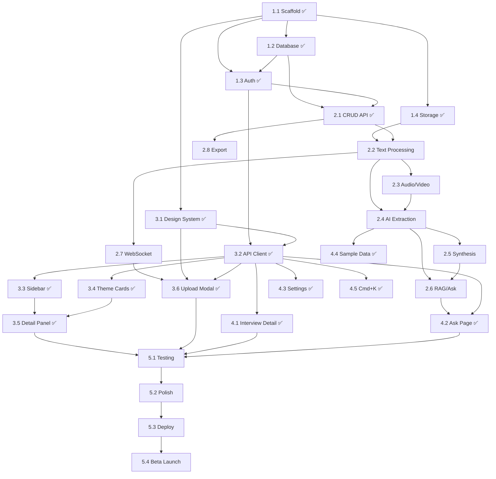

# Spec10x v0.1 — Project Tracker

> **Sprint:** Feb 23 – Feb 28, 2026 (5 days)
> **Goal:** Ship v0.1 MVP ("Interview Intelligence") — fully functional, deployed, ready for beta pilots
> **Team:** Solo developer (assisted by AI coding agents)

---

## Sprint Overview

```
Day 1 (Feb 24) — Foundation     │ ✅ COMPLETE — Project setup, database, auth, infra
Day 2 (Feb 24) — Backend Core   │ ✅ COMPLETE — AI pipeline (mock), processing, Q&A, export, billing
Day 3 (Feb 26) — Frontend Core  │ ✅ COMPLETE — Design system, layout, 3-panel dashboard, upload modal
Day 4 (Feb 26) — Frontend Pages │ ✅ COMPLETE — Interview detail, Ask page, settings, sample data, Cmd+K
Day 5 (Feb 28) — Polish & Ship  │ Testing, bug fixes, deploy, beta invite
```

---

## Day 1 — Foundation (✅ Completed Feb 24)

> **Goal:** Project scaffold running locally with database, auth, and file storage working end-to-end.
> **Status:** ✅ Complete — all code scaffolded, Docker services running, database migrated, backend & frontend both start locally.

### 1.1 Project Scaffold
- [x] Initialize monorepo structure (`frontend/`, `backend/`, `infra/`)
- [x] **Frontend:** Next.js 15 (React 19, TypeScript, App Router, Turbopack) via `create-next-app`
- [x] **Backend:** FastAPI project with full folder structure (`api/`, `models/`, `schemas/`, `core/`, `services/`, `workers/`, `prompts/`)
- [x] Create `docker-compose.yml` — PostgreSQL 17 + pgvector, Redis 7, MinIO (S3-compatible local storage)
- [x] Verify all three services start (`npm run dev`, `uvicorn`, `docker compose up`)
- [x] Create `.env.example` with all required env vars
- [x] Create `.gitignore` and `README.md` with full setup guide

**Deliverable:** ✅ Running frontend + backend + Docker services locally

---

### 1.2 Database Schema & Migrations
- [x] Install SQLAlchemy 2.0 + Alembic
- [x] Create ORM models: `User`, `Interview`, `Speaker`, `Theme`, `SubTheme`, `Insight`, `TranscriptChunk`, `AskConversation`, `AskMessage`, `Usage` — all 10 tables with enums, indexes, relationships, and pgvector `Vector(768)`
- [x] Set up pgvector extension via `infra/init-db.sql` (auto-runs on Docker startup)
- [x] Generate initial Alembic migration (`2a5fab2d4ce6_initial_schema.py`)
- [x] Run migration, verify all 10 tables created
- [x] Create seed script for sample/demo data (implemented as `POST /api/demo/load-sample-data` endpoint)

**Bug fixed:** Alembic auto-generation didn't include `import pgvector` in migration file. Fixed the migration and updated `script.py.mako` template to prevent this in future.

**Deliverable:** ✅ All 10 tables created with pgvector support

---

### 1.3 Authentication
- [ ] Create Firebase project in GCP Console *(see Firebase Setup Guide below)*
- [ ] Enable Email/Password and Google OAuth providers
- [x] Backend: `core/auth.py` — Firebase Admin SDK for JWT verification + dev-mode fallback (mock auth when `FIREBASE_PROJECT_ID` is empty)
- [x] Backend: Auth middleware (`get_current_user` FastAPI dependency)
- [x] Backend: `POST /api/auth/verify` — verify Firebase token, create or get user in DB
- [x] Backend: `GET /api/auth/me` — get currently authenticated user
- [x] Frontend: Install `firebase` SDK, create auth helpers in `lib/auth.ts` (with dev-mode mock)
- [x] Frontend: Create sign-up page (email + Google OAuth) with styled dark mode UI
- [x] Frontend: Create login page (email + Google OAuth)
- [x] Frontend: Create auth context/provider (`hooks/useAuth.tsx`)
- [ ] Test end-to-end: Sign up → login → API call → user created in DB *(requires Firebase)*

**Bug fixed:** Dev-mode fallback wasn't triggering because Firebase Admin SDK was initializing without a project ID (succeeding but broken). Fixed to check `firebase_project_id` before initialization.

**Deliverable:** ✅ Auth code complete. Dev-mode working. Full flow pending Firebase config.

---

### 1.4 File Storage Setup
- [x] MinIO bucket `spec10x-uploads` auto-created by docker-compose `minio-setup` service
- [x] Backend: `core/storage.py` — MinIO/GCS abstraction (signed upload/download URLs, file download, deletion)
- [x] Backend: `POST /api/interviews/upload-url` — returns signed URL for direct browser upload
- [ ] Test: Frontend uploads file directly to MinIO via signed URL *(will test during Day 2)*

**Deliverable:** ✅ Storage code complete. Upload URL endpoint working.

---

### 1.5 GCP Infrastructure (Staging)

> **⏸️ Deferred** — Using local Docker for all development. GCP staging will be set up after v0.1 is fully working and tested locally.

- [ ] Create GCP project `spec10x`
- [ ] Enable APIs: Cloud Run, Cloud SQL, Cloud Storage, Speech-to-Text, Vertex AI
- [ ] Create Cloud SQL instance (PostgreSQL, db-f1-micro)
- [ ] Enable pgvector extension on Cloud SQL
- [ ] Create Memorystore Redis instance (Basic, 1GB)
- [ ] Create GCS bucket `spec10x-uploads`
- [ ] Create service account with required IAM roles
- [ ] Set up Vertex AI — enable Gemini and Speech-to-Text APIs

---

### Day 1 Bonus: API Endpoints Scaffolded Early

These Day 2 CRUD endpoints were built during Day 1 with Pydantic schemas:

- [x] `POST /api/interviews` — register uploaded file, enqueue processing
- [x] `GET /api/interviews` — list all interviews (sort, filter)
- [x] `GET /api/interviews/:id` — interview detail (with speakers + insights)
- [x] `DELETE /api/interviews/:id` — delete with cascade
- [x] `GET /api/themes` — list themes (sort by urgency/frequency/sentiment/recency)
- [x] `GET /api/themes/:id` — theme detail (sub-themes + insights)
- [x] `PATCH /api/themes/:id` — rename theme
- [x] `POST /api/insights` — manually add insight
- [x] `PATCH /api/insights/:id` — edit insight
- [x] `DELETE /api/insights/:id` — dismiss (soft delete)
- [x] `POST /api/insights/:id/flag` — flag as uncertain

### Day 1 Bonus: Frontend Foundation Built Early

These Day 3 design system items were built during Day 1:

- [x] `styles/design-tokens.css` — all color, font, spacing, shadow variables per product spec
- [x] Import Inter + JetBrains Mono fonts (Google Fonts)
- [x] `lib/api.ts` — typed API client with all endpoint methods
- [x] Dark mode styles as default

---

### 🔧 Firebase Setup Guide (Do When Ready for Real Auth)

> Not needed for local development — the app runs with mock auth by default.

**Step 1: Create Firebase Project**
1. Go to [Firebase Console](https://console.firebase.google.com/)
2. Click **"Add project"** → Name it `spec10x` → Disable Google Analytics → Create

**Step 2: Enable Auth Providers**
1. **Authentication** → **Get started** → **Sign-in method** tab
2. Enable **Email/Password** (toggle on, save)
3. Enable **Google** (toggle on, select support email, save)

**Step 3: Get Frontend Config**
1. **Project Settings** (gear icon) → **General** → **Your apps** → Click Web (`</>`)
2. Register app name "Spec10x Web" → Register
3. Copy config values into `frontend/.env.local`:
```
NEXT_PUBLIC_API_URL=http://localhost:8000
NEXT_PUBLIC_FIREBASE_API_KEY=AIzaSy...
NEXT_PUBLIC_FIREBASE_AUTH_DOMAIN=spec10x-xxxxx.firebaseapp.com
NEXT_PUBLIC_FIREBASE_PROJECT_ID=spec10x-xxxxx
NEXT_PUBLIC_FIREBASE_STORAGE_BUCKET=spec10x-xxxxx.appspot.com
NEXT_PUBLIC_FIREBASE_MESSAGING_SENDER_ID=123456789
NEXT_PUBLIC_FIREBASE_APP_ID=1:123456789:web:abcdef
```

**Step 4: Get Backend Service Account**
1. **Project Settings** → **Service accounts** → **Generate new private key** → Download JSON
2. Save as `backend/firebase-service-account.json`
3. Update `backend/.env`:
```
FIREBASE_PROJECT_ID=spec10x-xxxxx
FIREBASE_SERVICE_ACCOUNT_PATH=./firebase-service-account.json
```

**Step 5: Restart & Test**
1. Restart backend + frontend
2. Go to `http://localhost:3000/signup` → Create account → Should redirect to dashboard

---

## Day 2 — Backend Core (✅ Completed Feb 24)

> **Goal:** Full backend API with AI processing pipeline working. Upload a file → get insights back.
> **Status:** ✅ Complete — all 7 phases implemented with mock AI (toggle `USE_MOCK_AI=false` for real Vertex AI). 20 API endpoints verified working.

### 2.1 Core API Endpoints (CRUD)
- [x] `POST /api/interviews` — register uploaded file, create Interview record, enqueue processing job
- [x] `GET /api/interviews` — list all interviews for user (with filters, sort)
- [x] `GET /api/interviews/:id` — interview detail (transcript + insights)
- [x] `DELETE /api/interviews/:id` — delete interview, cascade insights, recalculate themes
- [x] `GET /api/themes` — list all themes for user (sorted, paginated)
- [x] `GET /api/themes/:id` — theme detail (quotes, sources, sentiment)
- [x] `PATCH /api/themes/:id` — rename theme
- [x] `POST /api/insights` — manually add insight
- [x] `PATCH /api/insights/:id` — edit insight (category, title, theme)
- [x] `DELETE /api/insights/:id` — dismiss insight (soft delete)
- [x] `POST /api/insights/:id/flag` — flag as uncertain

**Dependencies:** 1.2 (database), 1.3 (auth middleware)
**Deliverable:** ✅ All CRUD endpoints working (built during Day 1)

---

### 2.2 File Processing Pipeline — Text Extraction
- [x] Install `arq` (async Redis job queue)
- [x] Create worker entry point (`workers/worker.py`)
- [x] Implement text extraction: `.txt` → read directly, `.md` → read directly
- [x] Implement text extraction: `.pdf` → PyPDF2
- [x] Implement text extraction: `.docx` → python-docx
- [x] Create `process_interview` job: download file from storage → extract text → save transcript to DB
- [x] Update interview status through pipeline: `queued` → `transcribing` → `analyzing` → `done`
- [ ] Test: Upload a `.txt` transcript file → text appears in DB *(needs end-to-end verification)*

**Dependencies:** 1.4 (file storage), 2.1 (interview endpoints)
**Deliverable:** ✅ Text extraction implemented (`.txt`, `.pdf`, `.docx` + mock audio/video)

---

### 2.3 File Processing Pipeline — Audio/Video
- [x] Mock transcript returned for `.mp3`, `.wav`, `.mp4` files (realistic multi-speaker sample)
- [ ] Install FFmpeg in worker Docker container *(deferred — requires GCP)*
- [ ] Implement Chirp 3 transcription via `google.cloud.speech_v2` SDK *(deferred — requires Vertex AI)*
- [ ] Duration limit check: reject files exceeding plan limit *(deferred)*

**Dependencies:** 2.2 (basic pipeline), 1.5 (Vertex AI enabled)
**Deliverable:** ⏸️ Mock transcripts working. Real transcription deferred until Vertex AI is configured.

---

### 2.4 AI Analysis — Theme Extraction
- [x] Create `services/analysis.py` — mock keyword/heuristic analysis (pain points, feature requests, positive feedback)
- [x] Design extraction prompt template stored in `prompts/extraction.py` (for future Gemini use)
- [x] Implement structured output: insights with category, title, quote, speaker, theme suggestion, confidence
- [x] Save extracted insights to DB (linked to interview, with quote positions)
- [x] Save detected speakers to DB (auto-detected from "Speaker 1:", "Interviewer:" patterns)
- [x] Handle low-confidence extractions (flag with `is_flagged = true` when confidence < 0.7)
- [ ] Switch to real Gemini extraction when Vertex AI is configured

**Dependencies:** 2.2 or 2.3 (transcript in DB)
**Deliverable:** ✅ Mock AI extraction working — interviews produce structured insights

---

### 2.5 AI Analysis — Cross-Interview Synthesis
- [x] Create `services/synthesis.py` — theme clustering logic
- [x] After each interview is processed, run synthesis for the user:
  - [x] Collect all `theme_suggestion` values from all insights
  - [x] Group by normalized string matching (mock mode)
  - [ ] Cluster by cosine similarity via embeddings (future — when Vertex AI is configured)
  - [x] Create or update `Theme` records
  - [x] Link insights to themes
  - [x] Calculate aggregated sentiment per theme (positive/neutral/negative)
  - [x] Mark new themes with `is_new = true`
- [x] Handle Signal vs Theme (1 source = Signal, 2+ sources = Theme)

**Dependencies:** 2.4 (insights in DB)
**Deliverable:** ✅ Theme clustering working (string-matching mock, embedding similarity future)

---

### 2.6 Embedding & RAG Setup
- [x] Create `services/embeddings.py` — chunk transcripts, generate embeddings
- [x] Implement chunking: ~500 tokens with 50-token overlap
- [x] Generate mock embeddings (random normalized 768-dim vectors)
- [x] Store chunks + embeddings in `transcript_chunks` table (pgvector)
- [ ] Create ivfflat index on embeddings column *(deferred — optimize later)*
- [x] Create `services/qa.py` — RAG pipeline:
  - [x] Full-text ILIKE search across chunks + insights (mock mode)
  - [ ] Vector similarity search + Gemini (future — when Vertex AI is configured)
  - [x] Build structured answer with citations
  - [x] Generate follow-up question suggestions
- [x] `POST /api/ask` — Q&A endpoint (mock: single response; future: SSE streaming)
- [x] `GET /api/ask/conversations` — list conversations
- [x] `GET /api/ask/conversations/:id` — conversation detail with messages

**Dependencies:** 2.4 (insights), transcripts in DB
**Deliverable:** ✅ "Ask Your Interviews" working on backend (mock full-text search, real RAG future)

---

### 2.7 WebSocket — Real-Time Updates
- [x] Create WebSocket endpoint `WS /ws/processing`
- [x] Broadcast processing status updates per file (queued, transcribing, analyzing, done)
- [x] Created `core/pubsub.py` — Redis pub/sub wrapper (publish + async subscribe generator)
- [x] Worker publishes status updates at each pipeline step
- [ ] Test: Start processing → WebSocket receives real-time status updates *(needs frontend client)*

**Dependencies:** 2.2 (processing pipeline), Redis
**Deliverable:** ✅ Real-time update infrastructure ready

---

### 2.8 Export & Billing Endpoints
- [x] `GET /api/export/insights` — export all insights as markdown (grouped by theme, with sentiment bars)
- [ ] `GET /api/export/insights?format=pdf` — export as PDF *(deferred — markdown only for now)*
- [x] `GET /api/export/interview/:id` — export single interview transcript + insights as markdown
- [ ] `GET /api/export/all-data` — full data export as ZIP *(deferred)*
- [x] `GET /api/billing/usage` — return current month's usage stats
- [x] `GET /api/billing/limits` — plan limits + remaining capacity
- [x] Usage tracking helpers: `increment_usage()`, `check_limit()` (auto-creates Usage row per month)
- [x] Plan limits defined per tier: Free (5 interviews, 20 Q&A), Pro (50/200), Business (500/2000)

**Dependencies:** 2.1 (API endpoints), 2.4 (insights exist)
**Deliverable:** ✅ Markdown export + usage/billing working. PDF export deferred.

---

## Day 3 — Frontend Core (✅ Completed Feb 26)

> **Goal:** Dashboard and upload modal fully functional with real data from the API.
> **Status:** ✅ Complete — 8 base UI components, NavBar with global layout, 3-panel dashboard, upload modal with full flow, 3 data hooks, dev-mode auth fix.

### 3.1 Design System & Global Layout
- [x] Create `styles/design-tokens.css` — all color, font, spacing, shadow variables *(built Day 1)*
- [x] Import Inter + JetBrains Mono fonts (Google Fonts) *(built Day 1)*
- [x] Create global layout: top nav bar (64px) persistent across all pages — `components/layout/AppLayout.tsx` + `app/(app)/layout.tsx`
- [x] Implement top nav: Logo, "Dashboard" link, "Ask ✨" link, search bar (⌘K), bell, avatar, gear — `components/layout/NavBar.tsx`
- [x] Implement active page indicator (blue underline)
- [x] Create base UI components: `Button`, `Card`, `Badge`, `Input`, `Modal`, `Tooltip`, `Skeleton`, `SentimentBar` — all in `components/ui/` with CSS modules
- [x] Create loading skeleton components (for data loading states) — `components/ui/Skeleton.tsx`
- [x] Dark mode styles as default *(built Day 1)*

**Dependencies:** Frontend scaffold (1.1)
**Deliverable:** ✅ Design system + global layout with nav bar + 8 reusable UI components

---

### 3.2 API Client & Auth Integration
- [x] Create `lib/api.ts` — API client with fetch, auto-attach Firebase token *(built Day 1)*
- [x] Create `hooks/useAuth.tsx` — auth context, login/logout, redirect *(built Day 1)*
- [x] Create `hooks/useInterviews.ts` — data fetching hook with sort/filter/refetch support
- [x] Create `hooks/useThemes.ts` — hook with active/previous theme separation
- [x] Create `hooks/useWebSocket.ts` — WebSocket connection with auto-reconnect for real-time updates
- [x] Implement protected route wrapper — redirect unauthenticated users to login *(built Day 1)*

**Bug fixed:** Dev-mode auth loop — `onAuthChange()` always fired with `null`, causing redirect back to login after successful mock login. Fixed by persisting dev session in `sessionStorage` in `lib/auth.ts`.

**Dependencies:** 3.1 (layout), 1.3 (auth), 2.1 (backend API)
**Deliverable:** ✅ Frontend can fetch and display data from backend

---

### 3.3 Insight Dashboard — Left Sidebar
- [x] Interview Library component (240px sidebar) — `components/dashboard/InterviewSidebar.tsx`
- [x] "+ Upload" button (electric blue, full width)
- [x] Search/filter input
- [x] Scrollable interview list (filename, status dot, file type, date)
- [x] Selected/active state (blue left border)
- [x] Sort dropdown (Recent first, By name, By sentiment)
- [x] Stats footer (interviews · insights · themes)
- [x] Empty state: "No interviews yet" with pulsing upload button

**Dependencies:** 3.2 (API hooks), 3.1 (design system)
**Deliverable:** ✅ Sidebar showing real interview data from API

---

### 3.4 Insight Dashboard — Center Theme Area
- [x] Header row: title, subtitle, sort toggles, "Ask" input — `components/dashboard/ThemeArea.tsx`
- [x] Theme card component (reusable) — `components/dashboard/ThemeCard.tsx`:
  - [x] Theme name + NEW badge + inline rename (edit icon)
  - [x] Mention count pill
  - [x] Sentiment bar (proportional green/amber/red) via `SentimentBar` component
  - [x] Placeholder quote text (full quotes visible in detail panel)
  - [x] Hover glow effect
  - [x] Click → loads detail in right panel
- [x] Theme card grid (2-column, responsive with 1-column fallback at 1400px)
- [x] "Show more themes" toggle
- [x] "Previous themes" collapsible section
- [x] Empty state: illustration + "Upload your first interviews" CTA + format pills + "Try with sample data"
- [x] Sort switching logic (urgency, frequency, sentiment, recency)

**Dependencies:** 3.2 (API hooks), 3.1 (design system)
**Deliverable:** ✅ Theme cards displaying real insights from API

---

### 3.5 Insight Dashboard — Right Detail Panel
- [x] Theme detail view (when theme card clicked) — `components/dashboard/DetailPanel.tsx`:
  - [x] Theme title with NEW badge
  - [x] Stats row (mention count, sentiment label)
  - [x] Sentiment breakdown bar with percentages
  - [x] Key quotes section (quote cards with sentiment-colored left borders)
  - [x] Description section
- [x] Interview detail view (when interview clicked in sidebar):
  - [x] Filename, file type, upload date, duration
  - [x] Quick stats, status badge
  - [x] Key insights from this interview (with colored borders)
  - [x] "View full transcript →" button
- [x] Default state: "Select a theme or interview to see details" + quick stats

**Dependencies:** 3.3 (sidebar), 3.4 (theme cards)
**Deliverable:** ✅ Fully functional 3-panel dashboard

---

### 3.6 Upload Modal
- [x] Modal component (720px, 80vh, dark backdrop, overlay) — `components/upload/UploadModal.tsx`
- [x] Drop zone (drag & drop, click to browse, format pills) — `components/upload/DropZone.tsx`
- [x] Collapsed drop zone state (compact bar after files added)
- [x] Processing queue — `components/upload/ProcessingQueue.tsx`:
  - [x] File rows (icon, filename, size, status indicator)
  - [x] Per-file progress bars
  - [x] Status states: queued → uploading → transcribing → analyzing → done → error
  - [x] Remove file button (hover)
  - [ ] Duration limit exceeded warning *(deferred)*
  - [x] Overall status bar ("Processing: X of Y files")
- [x] Live insight preview (right side):
  - [x] Processing status cards
  - [x] Pulsing green dot
- [x] Connect to WebSocket for real-time status updates (via `useWebSocket` hook)
- [x] Metadata review step (post-processing):
  - [x] File-by-file rows with editable fields (participant name, role, company)
  - [x] Skip / Save & Continue buttons
- [x] Completion state: "X interviews processed. Y insights discovered across Z themes."
- [x] "View Insights →" button (closes modal, refreshes dashboard)
- [x] Close confirmation if processing in progress

**Dependencies:** 3.1 (design system), 3.2 (API client), 2.7 (WebSocket)
**Deliverable:** ✅ Full upload flow working end-to-end

---

## Day 4 — Frontend Pages (✅ Completed Feb 26)

> **Goal:** All remaining pages functional. App is feature-complete.
> **Status:** ✅ Complete — Interview detail view, Ask page, Settings page, sample data endpoint, Cmd+K command palette. Build passes. All new routes: `/interview/[id]`, `/ask`, `/settings`.

### 4.1 Interview Detail View
- [x] Two-panel layout (65% transcript, 35% insights)
- [x] Breadcrumb bar: "← Dashboard > Interview Name"
- [x] "View Raw" toggle, "Export ↓" button
- [x] Participant header (name, metadata, theme pills)
- [x] Highlight legend bar (sticky, toggleable)
- [x] Transcript body:
  - [x] Speaker labels (Interviewer vs. participant styling)
  - [x] AI-highlighted passages (10% opacity colored backgrounds)
  - [x] Hover tooltip on highlights (theme name + category)
  - [x] Click highlight → scroll right panel to corresponding insight
- [x] Right panel — Extracted Insights:
  - [x] Insight card list (category pill, title, quote, theme, "Jump to quote")
  - [x] Active state when linked to transcript highlight
  - [x] "+ Add insight" button (manual)
  - [x] Edit/dismiss/flag actions on hover
- [x] Wire up export buttons to backend export endpoints

**Files created:** `app/(app)/interview/[id]/page.tsx`, `interview.module.css`, `TranscriptPanel.tsx`, `TranscriptPanel.module.css`, `InsightPanel.tsx`, `InsightPanel.module.css`

**Dependencies:** 3.2 (API client), 3.1 (design system), 2.1 (interview API)
**Deliverable:** ✅ Full transcript view with AI highlights and insight panel

---

### 4.2 Ask Your Interviews
- [x] Full-width centered chat layout (max 760px), same top nav
- [x] Chat header: title, subtitle, "New Chat" button
- [x] User message component (right-aligned, blue bubble)
- [x] AI response component (left-aligned, dark card):
  - [x] Basic markdown rendering (bold, lists)
  - [x] Inline citation badges (clickable, link to interview detail)
  - [x] Source footer
- [ ] Streaming response (SSE token-by-token display) *(deferred — uses full response for now)*
- [x] Suggested follow-up questions (pills below response)
- [x] First-time empty state (sparkle icon + 4 starter question cards in 2×2 grid)
- [x] Sticky input bar (chat input, send button, disclaimer text)
- [x] Connect to `POST /api/ask` endpoint

**Files created:** `app/(app)/ask/page.tsx`, `ask.module.css`, `hooks/useAsk.ts`

**Dependencies:** 3.2 (API client), 3.1 (design system), 2.6 (RAG backend)
**Deliverable:** ✅ AI chat with citations and follow-up suggestions

---

### 4.3 Settings Page
- [x] Simple layout with sections: Profile, Billing, Data Export, Danger Zone
- [x] Profile: Name, email, avatar (initials), plan badge
- [x] Billing: Current plan card, usage bars (interviews/Q&A/storage) with color warnings at 70%/90%, upgrade button
- [x] Data Export: Export all insights as Markdown download
- [x] Danger Zone: "Delete all data" and "Delete account" with red styling
- [x] Wire up to backend billing/export APIs

**Files created:** `app/(app)/settings/page.tsx`, `settings.module.css`

**Dependencies:** 3.1 (design system), 1.3 (auth), 2.8 (export endpoints)
**Deliverable:** ✅ Settings page functional

---

### 4.4 Sample Data & Empty States
- [x] Created `POST /api/demo/load-sample-data` backend endpoint (`api/demo.py`)
- [x] 3 realistic sample interviews: Sarah Chen (PM), Marcus Rivera (Design Lead), Priya Patel (CEO)
- [x] Each creates speakers, insights (with quote positions), and themes automatically
- [x] Themes generated: Manual Workflow Overhead, Data Fragmentation, Automated Insight Extraction, Cross-Interview Search, Report Export, Market Validation
- [x] Frontend: "Try with sample data" button in dashboard empty state → calls endpoint → refreshes dashboard
- [x] Duplicate protection: endpoint checks if user already has interviews before loading

**Files created:** `backend/app/api/demo.py`
**Files modified:** `backend/app/main.py` (registered demo router), `ThemeArea.tsx` (added `onLoadSampleData` prop), `dashboard/page.tsx` (added handler)

**Dependencies:** 2.4 (AI pipeline), 3.4 (dashboard), 3.6 (upload modal)
**Deliverable:** ✅ New users can instantly explore with sample data

---

### 4.5 Cmd+K Command Palette
- [x] Global keyboard listener for `Ctrl+K` / `Cmd+K` (in `AppLayout.tsx`)
- [x] Modal overlay: search input + grouped results (Pages, Interviews, Themes)
- [x] Live filtering as user types
- [x] Keyboard navigation (Arrow keys, Enter to select, Escape to close)
- [x] Mouse hover selection
- [x] Navigate to selected result
- [x] Search bar in NavBar wired to open palette

**Files created:** `CommandPalette.tsx`, `CommandPalette.module.css`
**Files modified:** `AppLayout.tsx` (added palette + `Ctrl+K` listener), `NavBar.tsx` (wired search click)

### 4.0 API Client Extensions
- [x] Added `useAsk` hook for Q&A and conversations
- [x] Added Ask endpoints (askQuestion, listConversations, getConversation)
- [x] Added Export endpoints (exportInsights, exportInterview)
- [x] Added Billing endpoints (getUsage, getLimits)
- [x] Added Sample Data endpoint (loadSampleData)
- [x] Added 9 corresponding TypeScript types

**Dependencies:** 3.2 (API client)
**Deliverable:** ✅ Quick navigation via keyboard

---

## Day 5 — Polish & Ship (Feb 28, Saturday)

> **Goal:** Testing, bug fixes, performance, deploy to production. Ready for beta.

### 5.1 Integration Testing
- [ ] Full flow test: Sign up → upload 3 files (1 txt, 1 pdf, 1 mp3) → watch processing → see insights
- [ ] Test dashboard: themes appear, sort works, click theme → detail panel works
- [ ] Test interview detail: highlights visible, click highlight → insight scrolls
- [ ] Test Ask: ask a question → get answer with citations → click citation → navigates
- [ ] Test export: download markdown, download PDF
- [ ] Test settings: view billing, export data
- [ ] Test plan limits: free tier (10 interviews, 20 Q&A queries)
- [ ] Test duplicate file detection (upload same file twice)
- [ ] Test edge cases: empty transcript, very long transcript, non-English content

**Dependencies:** Everything above
**Deliverable:** All critical paths tested and working

---

### 5.2 Performance & Polish
- [ ] Optimize theme card rendering (virtualize list if needed)
- [ ] Add loading skeletons for all async operations
- [ ] Add error boundaries and empty states for all pages
- [ ] Check responsive behavior (minimum: 1280px+ desktop)
- [ ] Verify dark mode consistency across all pages
- [ ] Add toast notifications (success, error messages)
- [ ] Add page title/meta tags for each route
- [ ] Review transition animations (200ms ease-out on all hover effects)

**Dependencies:** 5.1 (tested)
**Deliverable:** Polished, fast, visually consistent

---

### 5.3 Deployment
- [ ] Create `Dockerfile.frontend` (Next.js production build)
- [ ] Create `Dockerfile.backend` (FastAPI + FFmpeg + dependencies)
- [ ] Create `Dockerfile.worker` (same as backend, optimized for background jobs)
- [ ] Manually deploy to Cloud Run (frontend, backend, worker)
- [ ] Run Alembic migration on Cloud SQL
- [ ] Configure Cloud Run custom domain mapping (spec10x.com via GoDaddy CNAME)
- [ ] Verify SSL certificate auto-provisioned
- [ ] Set environment variables in Cloud Run (secrets via GCP Secret Manager)
- [ ] Smoke test on production: sign up, upload, process, view insights, ask question
- [ ] Set up basic monitoring: Cloud Run logs, error alerting in Sentry

**Dependencies:** 5.2 (polished), 1.5 (GCP infra)
**Deliverable:** App live at spec10x.com

---

### 5.4 Beta Launch Prep
- [ ] Create first beta user accounts or whitelist
- [ ] Write quick-start guide (1-page: sign up → upload → explore)
- [ ] Send beta invite emails to first 5-10 pilot users
- [ ] Set up feedback channel (email, or simple Google Form)

**Dependencies:** 5.3 (deployed)
**Deliverable:** Beta pilots have access and can start using the product

---

## Dependencies Map



---

## Risk Register

| Risk | Likelihood | Impact | Mitigation |
|---|---|---|---|
| Chirp 3 transcription is slow for long files | Medium | Medium | Use BatchRecognize for files >5 min. Show estimated time in UI |
| Gemini extraction quality is inconsistent | Medium | High | Test with 5+ real interviews on Day 2. Iterate prompt if needed |
| Cloud Run custom domain SSL takes time to provision | Low | Medium | Start provisioning on Day 1. Can use `.run.app` URL for initial beta if delayed |
| Cross-interview theme clustering produces bad clusters | Medium | Medium | Start with simple cosine similarity threshold. Manual rename covers edge cases |
| Frontend polish takes longer than Day 5 allows | High | Low | Day 6 buffer exists. MVP can ship with minor UI polish remaining |
| File processing pipeline has edge cases | High | Medium | Focus on `.txt` and `.pdf` first (most common). Audio/video is nice-to-have for Day 1 pilots |

---

## Definition of Done (for v0.1 ship)

- [ ] New user can sign up (email or Google)
- [ ] User can upload transcript files (.txt, .pdf, .docx) and they process successfully
- [ ] Audio files (.mp3, .wav) transcribe and process (video is a stretch goal)
- [ ] Dashboard shows AI-discovered themes with quotes and sentiment
- [ ] User can click a theme → see full detail with evidence
- [ ] User can view full interview transcript with AI highlights
- [ ] User can ask questions and get cited answers
- [ ] Export works (at minimum: markdown)
- [ ] App is deployed and accessible via URL
- [ ] 5 beta users can access and use the product
